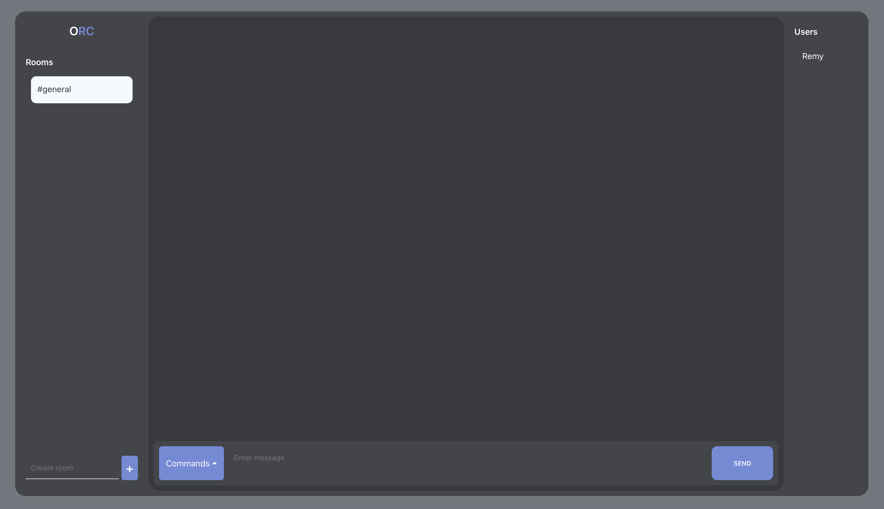

# MTNsnaps

This project is a fully functional online chat, made with Express.js (socket.io) and React.js. Log in and chat with users in different channels.
Made in collaboration with KABANGA-MUYA Ruben (https://github.com/aretwojay)




### Project restrictions
- Node.js
- Socket.io
- React.js

### Things I learned making this project
- Using websockets (socket.io)
- React.js
- Express.js

### Pre-requisites
Node.js

## Installation
Clone the repo to get started.

Go into the backend folder
```sh
npm install
```
When done, run
```sh
nodemon index.js
```

Then go into the frontend folder
```sh
npm install
```
When done, run
```sh
npm start
```

Enter your username and start chatting !

## License
MIT